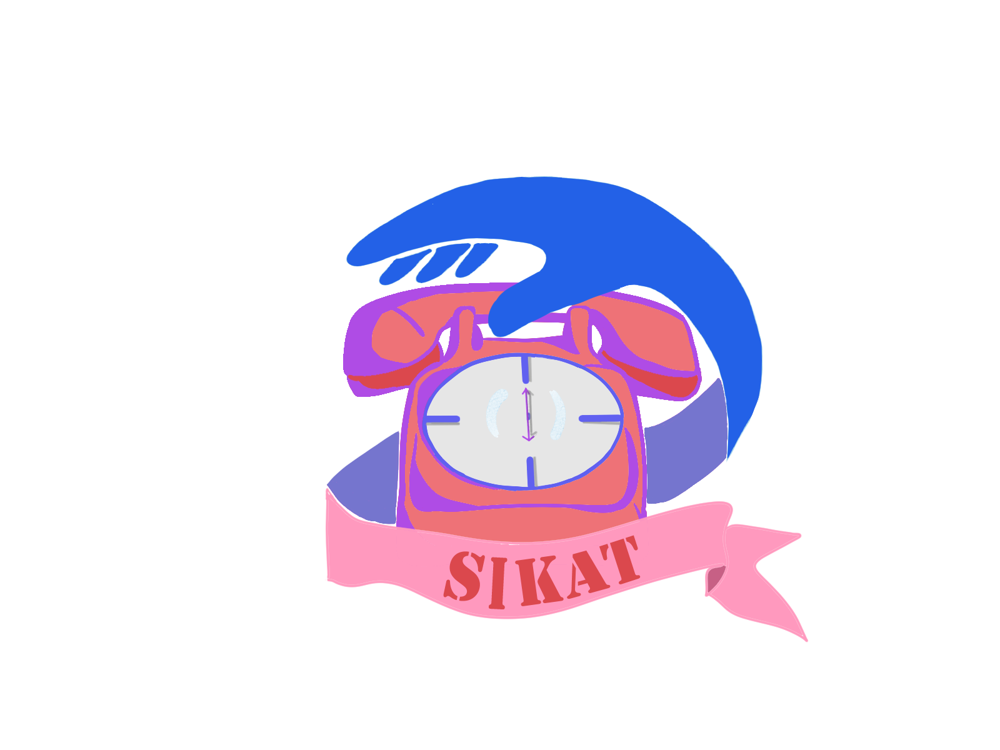

</a>

## 𝐀𝐛𝐨𝐮𝐭 <b><big><big>𝐒𝐢𝐤𝐚𝐭</big></b>
Sikat (Sistem Informasi Kecemasan Darurat) merupakan sebuah aplikasi berbasis web yang didalamnya terdapat nomor darurat yang terhubung langsung kerumah sakit. Sehingga baik masyarakat sekitar maupun pasien tersebut sendiri yang memerlukan bantuan dapat secara langsung memperoleh bantuan oleh rumah sakit. Aplikasi ini didesain secara simple sehingga penggunaanya dalam waktu darurat akan mempercepat pertolongan sampai ke lokasi.

<h2>𝐅𝐫𝐞𝐪𝐮𝐞𝐧𝐭𝐥𝐲 𝐀𝐬𝐤𝐞𝐝 𝐐𝐮𝐞𝐬𝐭𝐢𝐨𝐧𝐬</h2>

&nbsp;Bagaimana laporan saya diproses?

<small>
&nbsp;&nbsp;&nbsp; Laporan anda akan diverifikasi </small>
<small> 
&nbsp;&nbsp;&nbsp; Laporan yang diterima akan diproses </small> 

<small>
&nbsp;&nbsp;&nbsp; Laporan berhasil </small>

&nbsp;Apa yang diperlukan saat registrasi akun?

<small>
&nbsp;&nbsp;&nbsp;&nbsp;&nbsp;Saat mendaftar user akan mengisi email, nomor telepon, username akun serta password yang akan dipakai saat melakukan login.
</small>

## 𝐀𝐛𝐨𝐮𝐭 𝐓𝐡𝐞 𝐏𝐫𝐨𝐣𝐞𝐜𝐭
<small>Project ini dikerjakan dengan Laravel. Laravel adalah kerangka kerja aplikasi web berbasis PHP yang sumber terbuka, menggunakan konsep Model-View-Controller. Laravel berada dibawah lisensi MIT, dengan menggunakan GitHub sebagai tempat berbagi kode.</small>

&nbsp;&nbsp;&nbsp;

|     Anggota  | NPM |
| :---: | :---: |
|  Muhammad Razan Fawwaz  |  2008107010098  |
| Tsani Aflah |  2008107010015 |
| Stefhani Alba Siregar | 2008107010057  |
|  Rizka Nuzulia| 2008107010012  |
|  Iftahul Fadhlan | 2008107010024  |

## 𝐋𝐢𝐜𝐞𝐧𝐬𝐞

Laravel adalah framework perangkat lunak open source yang dilisensikan di bawah [MIT license](https://opensource.org/licenses/MIT).

